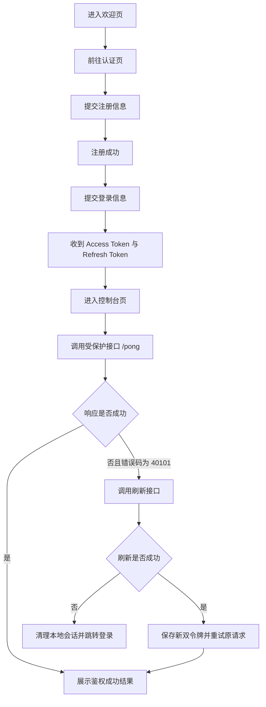

## 1. 产品概述
`mint-auth-console` 是一个与 `mint` 后端配套的桌面优先认证演示前端，聚焦注册、登录、令牌刷新与受保护接口调用的完整闭环。
- 目标用户是开发者、测试人员和后续接手博客业务的前端开发者，用它快速验证当前 Go 后端的认证能力与错误码设计。
- 产品价值在于把现有后端能力可视化，清晰呈现 Access Token 过期、Refresh Token 轮转、重新登录等关键链路，降低联调与排障成本。

## 2. 核心功能

### 2.1 功能模块
1. **欢迎页**：项目介绍、接口能力概览、快速跳转到登录或注册。
2. **认证页**：注册表单、登录表单、错误提示、登录成功后的令牌落库。
3. **控制台页**：展示当前认证状态、令牌摘要、受保护接口调用结果、刷新令牌操作与登出。

### 2.2 页面详情
| 页面名称 | 模块名称 | 功能说明 |
|-----------|-----------|-----------|
| 欢迎页 | Hero 介绍区 | 展示 `mint` 后端的认证能力、错误码机制与联调入口 |
| 欢迎页 | 能力卡片区 | 说明注册、登录、刷新、受保护接口验证四类能力 |
| 欢迎页 | 环境配置区 | 展示 API Base URL、当前环境状态与联调提示 |
| 认证页 | 注册表单 | 提交 `username`、`password`、`re_password`、`email`、`gender` 完成注册 |
| 认证页 | 登录表单 | 提交 `username`、`password` 获取 `access_token` 与 `refresh_token` |
| 认证页 | 错误反馈区 | 对参数错误、用户名存在、密码错误等后端消息做直接反馈 |
| 控制台页 | 会话状态卡 | 展示登录状态、当前用户 `sub`、Token 是否存在、最近一次鉴权结果 |
| 控制台页 | 令牌管理区 | 展示 Access/Refresh Token 摘要、复制、清除、本地持久化状态 |
| 控制台页 | 受保护请求区 | 调用 `/pong`，展示成功结果或鉴权失败原因 |
| 控制台页 | 刷新链路区 | 手动调用 `/api/auth/refresh`，成功后更新双令牌，失败时根据错误码决定是否强制退出 |
| 控制台页 | 日志时间线 | 记录注册、登录、刷新、请求失败等关键操作，辅助调试 |

## 3. 核心流程
用户首先进入欢迎页理解系统能力，可选择注册或直接登录。注册成功后回到登录流程，登录成功将 Access Token 与 Refresh Token 保存到本地状态和持久化存储，并跳转到控制台页。控制台页支持调用受保护接口；若接口因 Access Token 过期返回 `40101`，前端触发刷新流程，请求 `/api/auth/refresh` 获取新双令牌并自动重试一次原请求；若刷新失败且错误码为 `40105` 或 `40104`，则清理本地令牌并引导重新登录。

## 4. 用户界面设计
### 4.1 设计风格
- 主色调采用深墨绿、石墨黑与高亮青色，形成“终端控制台 + 设计感仪表盘”的技术氛围。
- 按钮使用高对比描边与柔和发光阴影，大按钮强调主流程，小按钮用于复制、刷新和清理。
- 标题字体使用具有机械感的展示字体，正文字体使用清晰的无衬线字体，营造严谨但不呆板的气质。
- 布局采用桌面优先的多区块仪表盘结构：左侧叙事与导航，右侧表单或数据面板，控制台页采用不对称卡片网格。
- 图标建议使用线性图标搭配少量状态色点缀，避免过度拟物。

### 4.2 页面设计概览
| 页面名称 | 模块名称 | UI 元素 |
|-----------|-----------|-----------|
| 欢迎页 | Hero 介绍区 | 大标题、能力标签、双 CTA 按钮、背景网格与光晕动画 |
| 欢迎页 | 能力卡片区 | 倾斜卡片、状态标签、后端接口路径、错误码徽标 |
| 认证页 | 双栏认证区 | 左侧说明、右侧选项卡表单、输入聚焦发光、提交加载态 |
| 认证页 | 错误反馈区 | 浮层提示、字段级错误、后端消息回显 |
| 控制台页 | 会话状态卡 | 用户编号、登录状态灯、Token 过期提示、最近响应时间 |
| 控制台页 | 令牌管理区 | 摘要文本、复制按钮、掩码切换、更新时间 |
| 控制台页 | 日志时间线 | 滚动日志列表、操作标签、错误高亮、成功渐变标记 |

### 4.3 响应式策略
- 默认按桌面端体验设计，适配宽屏开发环境与本地联调窗口。
- 在平板与移动端下收敛为单列布局，优先保留认证流程和核心状态卡。
- 表单控件、按钮和日志区域保持触控友好，避免过小点击区域。
