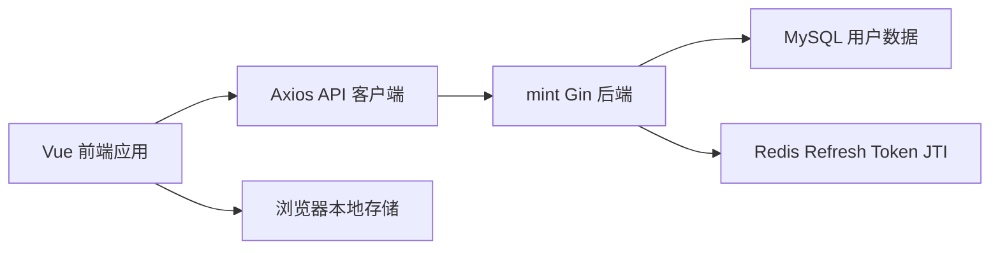
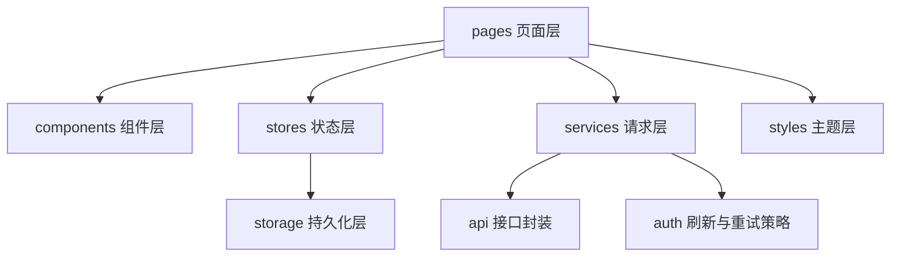

## 1. 架构设计


## 2. 技术描述
- 前端框架：Vue 3 + TypeScript + Vite
- 路由管理：Vue Router 4
- 状态管理：Pinia
- HTTP 客户端：Axios
- 样式方案：原生 CSS + CSS 变量 + 组件级样式拆分
- 构建目录：前端项目位于 `g:\GoCode\mint-web`，与 `mint` 后端平级
- 运行方式：本地开发默认 `5173` 端口，通过环境变量指定后端 API 地址

## 3. 路由定义
| 路由 | 用途 |
|-------|------|
| / | 欢迎页，展示项目能力与入口 |
| /auth | 认证页，承载注册与登录 |
| /console | 控制台页，展示会话状态、令牌与受保护请求结果 |

## 4. API 定义
### 4.1 TypeScript 类型定义
```ts
type ApiError = {
  code: number
  msg: string
  data?: unknown
}

type RegisterPayload = {
  username: string
  password: string
  re_password: string
  email?: string
  gender?: 0 | 1 | 2
}

type LoginPayload = {
  username: string
  password: string
}

type RefreshPayload = {
  refresh_token: string
}

type LoginResponse = {
  message: string
  access_token: string
  refresh_token: string
}

type PongResponse = {
  message: string
  userID: number
}
```

### 4.2 接口清单
| 方法 | 路径 | 用途 | 认证要求 |
|------|------|------|----------|
| GET | / | 服务欢迎信息 | 否 |
| POST | /register | 用户注册 | 否 |
| POST | /login | 用户登录 | 否 |
| POST | /api/auth/refresh | 刷新双令牌 | 否，提交 `refresh_token` |
| GET | /pong/public | 公共探活 | 否 |
| GET | /pong | 鉴权探活 | 是，需 `Authorization: Bearer <access_token>` |

### 4.3 前端错误处理约定
- `40101`：Access Token 已过期，前端自动尝试刷新并重放一次原请求。
- `40105`：Refresh Token 已过期，前端清空本地会话并提示重新登录。
- `40104`：Token 无效或 Refresh Token 被作废，前端清空会话并提示重新登录。
- `40102`、`40103`：签名或格式错误，前端停止重试并展示错误详情。
- `40001` 到 `40004`：表单或登录类错误，直接在当前页面反馈。

## 5. 前端模块分层


## 6. 数据模型
### 6.1 前端会话模型
```ts
type AuthSession = {
  accessToken: string
  refreshToken: string
  currentUserId: number | null
  isAuthenticated: boolean
  lastRefreshAt: string | null
}

type ActivityLog = {
  id: string
  type: 'info' | 'success' | 'warning' | 'error'
  title: string
  detail: string
  createdAt: string
}
```

### 6.2 持久化约定
- `localStorage.mint.auth`：保存双令牌与最后一次刷新时间。
- 内存状态优先，应用启动时从本地存储恢复。
- 登出、刷新失败或令牌作废时立即清空本地存储。

## 7. 实施约束
- 不引入 UI 组件库，优先自定义界面以保持视觉独特性与体积可控。
- 使用 Axios 响应拦截器统一处理 `40101` 自动刷新逻辑，并保证同一时间只有一次刷新请求在飞行。
- 控制台页必须显式展示当前使用的后端地址、最近一次接口响应及错误码，方便联调。
- 所有文案、错误提示与状态标签使用中文，与后端错误消息保持一致。
